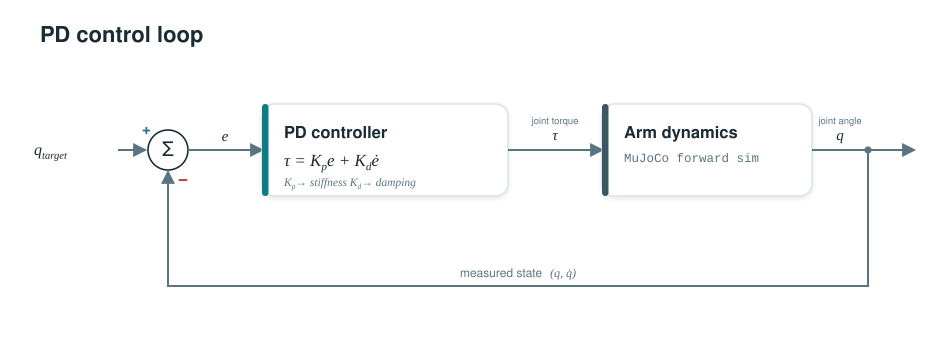
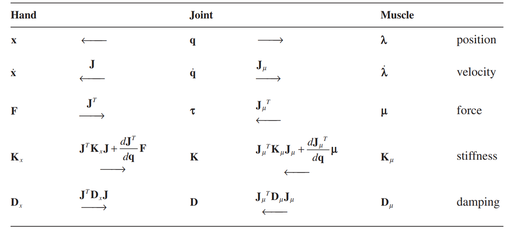
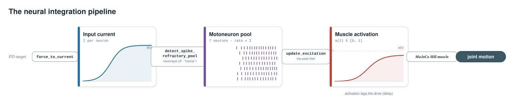
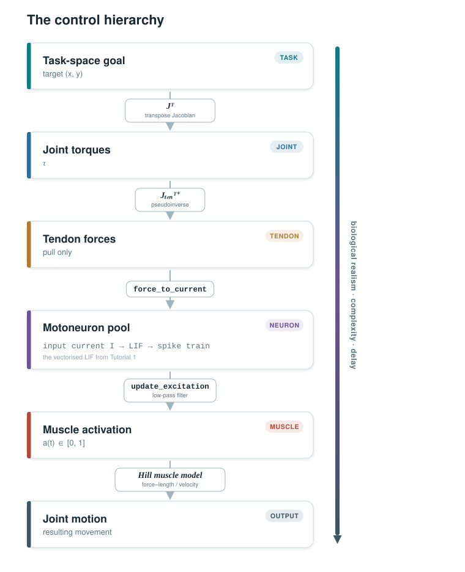

# Tutorial 2: Controlling a Musculoskeletal Arm

**Workshop Day 2 — From PD control to a neural-driven musculoskeletal model**

---

  <video 
    width="700" 
    autoplay 
    muted 
    loop 
    playsinline 
    controls
    preload="auto"
  >
    <source src="../_static/mujoco.mp4" type="video/mp4">
  </video>

## Why this tutorial?

In the previous tutorial, you built a single LIF neuron and scaled it to a pool that produces muscle
excitation. Now, we close the loop: those excitation signals will drive **muscles**
attached to a MuJoCo arm, and a **PD controller** will tell the neurons what to do.

We walk through five scripts, each one closer to biology:

| # | Script | What controls the arm | What you learn |
|---|---|---|---|
| 1 | [`01_pd_joint_space.py`](https://github.com/Balint-H/ssnr_sim/blob/main/src/ssnr_sim/SSNR2026/01_pd_joint_space.py) | Joint torques | PD control basics |
| 2 | [`02_pd_task_space.py`](https://github.com/Balint-H/ssnr_sim/blob/main/src/ssnr_sim/SSNR2026/02_pd_task_space.py) | Task-space forces via Jacobian | Coordinate transforms |
| 3 | [`03_pd_tendon_space.py`](https://github.com/Balint-H/ssnr_sim/blob/main/src/ssnr_sim/SSNR2026/03_pd_tendon_space.py) | Tendon forces | Redundancy, pulling-only |
| 4 | [`04_pd_muscle_space.py`](https://github.com/Balint-H/ssnr_sim/blob/main/src/ssnr_sim/SSNR2026/04_pd_muscle_space.py) | Muscle activations | Hill-type muscle model |
| 5 | [`05_pd_neuron_integration.py`](https://github.com/Balint-H/ssnr_sim/blob/main/src/ssnr_sim/SSNR2026/05_pd_neuron_integration.py) | Motoneuron pool | Full neural–musculoskeletal loop |

---

## Section 1: PD control in joint space

### The idea

The simplest way to move a robot arm: apply a torque at each joint proportional to
the **position error** and the **velocity error**:

$$
\boldsymbol{\tau} = K_p \, \mathbf{e} + K_d \, \dot{\mathbf{e}}
$$

where $\mathbf{e} = \mathbf{q}_{\text{target}} - \mathbf{q}$ is the joint-angle error
and $\dot{\mathbf{e}} = -\dot{\mathbf{q}}$.

- $K_p$ too low → arm doesn't reach
- $K_p$ too high → oscillations
- $K_d$ adds damping

See also: [detailed notes](01_joint_space.md)

## Section 2: PD control in task space

### The problem

We usually care about where the **fingertip** is, not joint angles. How do we convert
a desired fingertip position into joint torques?

### The Jacobian

The **Jacobian** $\mathbf{J}$ maps joint velocities to end-effector velocities:

$$
\dot{\mathbf{x}} = \mathbf{J}(\mathbf{q}) \, \dot{\mathbf{q}}
$$

It depends on the current arm configuration, so we recompute it every timestep.
To convert a task-space force into joint torques:

$$
\boldsymbol{\tau} = \mathbf{J}^T \, \mathbf{f}_{\text{task}}
$$

The PD controller now operates on errors in Cartesian (x, y) coordinates:

$$
\mathbf{f}_{\text{task}} = K_p
\begin{pmatrix} x_t - x \\ y_t - y \\ 0 \end{pmatrix}
+ K_d
\begin{pmatrix} -\dot{x} \\ -\dot{y} \\ 0 \end{pmatrix}
$$

See also: [detailed notes](02_task_space.md)

## Section 3: From joints to tendons

### The problem

Real joints aren't driven by torque motors, they are pulled by **tendons**. A tendon
can only **pull**, never push. We need at least two tendons per joint
(agonist / antagonist).

### The tendon Jacobian

The **tendon Jacobian** $\mathbf{J}_{\text{ten}}$ maps joint velocities to tendon
velocities. To go from desired joint torques to tendon forces:

$$
\mathbf{f}_{\text{tendon}} =
\mathbf{J}_{\text{ten}}^{T\,+} \, \boldsymbol{\tau}_{\text{desired}}
$$

The $^+$ is the **pseudoinverse**, because there are more tendons than joints (the
system is **redundant**).

See also: [detailed notes](03_tendon_space.md)

## Section 4: Muscle model

### From ideal tendons to muscles

Real muscles are not ideal force generators. MuJoCo provides a **Hill-type muscle
model** with:

- **Force–length** relationship — muscles have an optimal length
- **Force–velocity** relationship — less force when contracting fast
- **Activation dynamics** — force lags behind the neural command

The control input is now **activation** $a \in [0, 1]$, not force.

See also: [detailed notes](04_muscle_space.md)

## Section 5: Closing the loop with motoneurons

### The full pipeline

This is where **Tutorial 1** meets **Tutorial 2**. Instead of sending activation
values directly to muscles, we route the signal through a LIF neuron pool:

See also: [detailed notes](05_neural_integration.md) 

## Summary: the control hierarchy

Each level adds **biological realism** but also **complexity** and **delay**.
Understanding how the brain manages this cascade in real time is the central challenge
in motor neuroscience.

