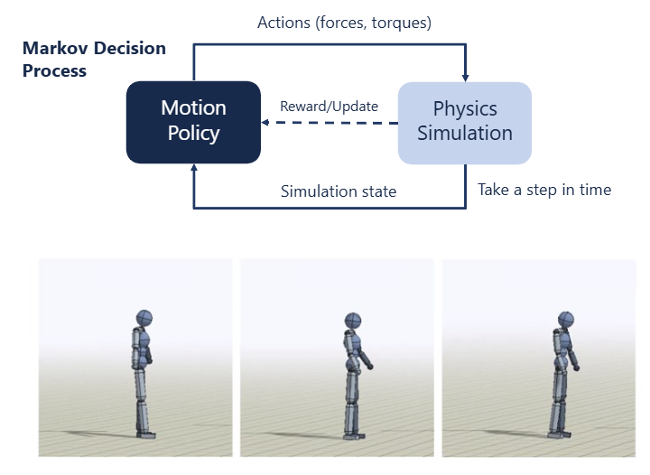
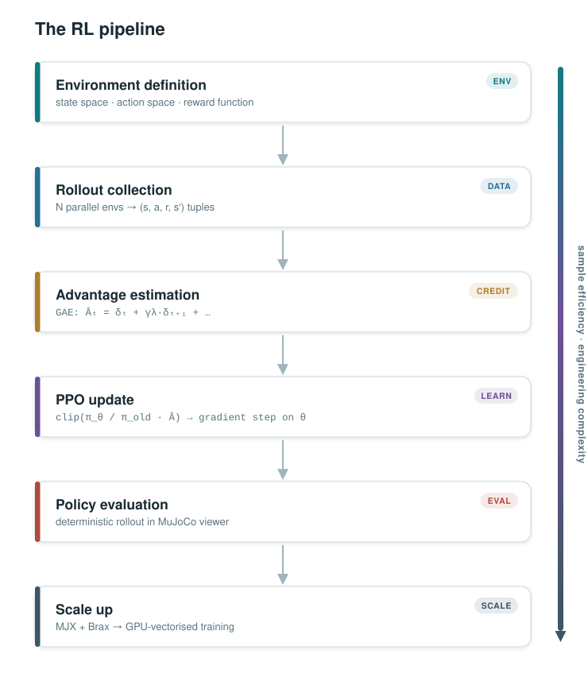

# Tutorial 3: Reinforcement Learning for Motor Control

**Workshop Day 3 — Learning to move without knowing the rules**

---

## Why this tutorial?

In the previous two tutorials you designed controllers by hand: first a PD law that specifies exactly what torque to apply given an error, then a neuron pool that converts that command into muscle activations. Both approaches assume you can write down the right objective and the right mapping.

Here we flip the problem. Instead of specifying the controller, we specify only a **reward signal** and let an agent discover the behaviour on its own through trial and error. This is **Reinforcement Learning**.

We work through five steps, from a toy problem on a single CPU to a musculoskeletal arm running on thousands of parallel GPU simulations:

| # | File | Simulated system | What you learn |
|---|---|---|---|
| 1 | [`cartpole.py`](https://github.com/Balint-H/ssnr_sim/blob/main/RL/cartpole.py) | Cartpole (env definition) | MDP formulation, reward shaping |
| 2 | [`learn.py`](https://github.com/Balint-H/ssnr_sim/blob/main/RL/learn.py) | Cartpole swing-up | PPO training, parallel environments |
| 3 | [`visualise_cartpole.py`](https://github.com/Balint-H/ssnr_sim/blob/main/RL/visualise_cartpole.py) | Cartpole (loaded policy) | Policy evaluation, MuJoCo viewer callback |
| 5 | [`train_with_mjx.ipynb`](https://github.com/Balint-H/ssnr_sim/blob/main/RL/train_with_mjx.ipynb) | Cartpole on GPU | MJX, JAX-vectorized training, Brax PPO |

---

## Section 1: Defining the MDP

### The four components

Every RL problem is a **Markov Decision Process**:

| Symbol | Name | In our cartpole |
|---|---|---|
| $s$ | State | Cart position, pole angle, velocities |
| $a$ | Action | Horizontal force on cart |
| $r(s, a)$ | Reward | How good was this transition? |
| $\pi(a \mid s)$ | Policy | The neural network we are learning |

The agent's goal is to find the policy $\pi^*$ that maximises cumulative discounted reward:

$$
J(\pi) = \mathbb{E}_{\pi} \left[ \sum_{t=0}^{T} \gamma^t \, r_t \right]
$$

where $\gamma \in (0,1)$ is a discount factor that down-weights distant rewards.

<div style="text-align:center; margin: 2rem 0;">

</div>

### Reward shaping

The reward in [`cartpole.py`](https://github.com/Balint-H/ssnr_sim/blob/main/RL/cartpole.py) is intentionally incomplete:

```python
upright = (np.cos(physics.data.qpos[1]) + 1) / 2
return upright
```

This only rewards keeping the pole upright. The agent learns to balance, but drifts to the edge of the track. **Your exercise** is to add terms that penalise:
- the cart moving away from centre
- large control inputs

See [`cartpole_solution.py`](https://github.com/Balint-H/ssnr_sim/blob/main/RL/cartpole_solution.py) for a shaped reward that also includes centering and small-control terms.


## Section 2: Training with PPO

### Policy gradient

The policy $\pi_\theta(a \mid s)$ is a neural network with parameters $\theta$. We want to update $\theta$ so that $J(\pi_\theta)$ increases. The **policy gradient theorem** gives us a tractable gradient:

$$
\nabla_\theta J(\theta) = \mathbb{E}_{\pi_\theta} \left[ \nabla_\theta \log \pi_\theta(a \mid s) \cdot A(s, a) \right]
$$

where $A(s, a) = Q(s, a) - V(s)$ is the **advantage** — how much better action $a$ was compared to average.

### PPO clipping

Vanilla policy gradient can take steps that are too large and destabilise training. **Proximal Policy Optimisation (PPO)** limits the step size with a clipped objective:

$$
\mathcal{L}^{\text{CLIP}}(\theta) = \mathbb{E} \left[ \min \left( r_t(\theta) \, A_t, \; \text{clip}(r_t(\theta), 1-\varepsilon, 1+\varepsilon) \, A_t \right) \right]
$$

where $r_t(\theta) = \pi_\theta(a_t \mid s_t) / \pi_{\theta_\text{old}}(a_t \mid s_t)$ is the probability ratio.

### Parallel environments

A single simulation step takes ~2 ms; collecting 2048 steps sequentially would take ~4 s per update. [`learn.py`](https://github.com/Balint-H/ssnr_sim/blob/main/RL/learn.py) uses `SubprocVecEnv` to run $N$ independent copies of the environment in parallel across CPU processes, so data collection takes $\sim 4/N$ seconds instead.


## Section 3: Evaluating the learned policy

Once trained, the policy is saved as a `.zip` file by Stable-Baselines3. [`visualise_cartpole.py`](https://github.com/Balint-H/ssnr_sim/blob/main/RL/visualise_cartpole.py) loads it and injects it into the MuJoCo viewer via a **control callback** — a function MuJoCo calls every physics step to set `data.ctrl`:

```python
def control_callback(model, data):
    obs = get_observation(data)
    action, _ = policy.predict(obs, deterministic=True)
    data.ctrl[:] = action
```

`deterministic=True` removes the sampling noise used during training so the policy runs its best estimated action.


## Section 4: From a toy to a musculoskeletal arm + GPU-accelerated training with MJX

[`learn_myosuite.py`](https://github.com/Balint-H/ssnr_sim/blob/main/RL/learn_myosuite.py) implements the planar arm control scene you explored in days 1 and 2 as a RL env, a Two things change compared to cartpole:

**Harder action space.** The action $a \in [0,1]^6$ is a vector of muscle activations. Muscles can only pull, are nonlinear (Hill model), and have dynamics — activation lags behind the neural command. The policy must learn to co-activate antagonistic pairs to achieve stiffness control, something a PD controller gets for free.

**Multiple degrees of freedom.** The extra DoFs also make exploration harder.

This tutorial is meant to be ran on Colab: [](https://colab.research.google.com/github/Balint-H/ssnr_sim/blob/main/src/ssnr_sim/RL/train_muscle_arm.ipynb)

[`train_muscle_arm.ipynb`](https://github.com/Balint-H/ssnr_sim/blob/main/RL/train_muscle_arm.ipynb) ports the cartpole environment to **MJX**, the JAX-based reimplementation of MuJoCo. The entire simulation runs on the GPU as a JIT-compiled function, enabling:

- **Massive parallelism**: 4 096 environments in a single batch with no inter-process overhead
- **Observation normalisation**: Raw joint angles, velocities, and muscle states span very different numeric ranges. The observations tracks a running mean and variance and rescales observations to zero mean, unit variance. This is almost always necessary for RL on biomechanical models.
- **Automatic differentiation**: gradients through the physics are available if needed
- **Brax PPO**: a fully vectorised, JAX-native PPO implementation that pipelines rollout collection and gradient updates

The training loop processes $\sim 30 \times 10^6$ environment steps in minutes on a GPU, compared to hours on CPU.


## Summary: the full RL pipeline

<div style="text-align:center; margin: 2rem 0;">

</div>


Each level adds **sample efficiency** (more data per wall-clock second) but also **engineering complexity**. Understanding which bottleneck limits your training is the core skill in applied RL for motor control.
